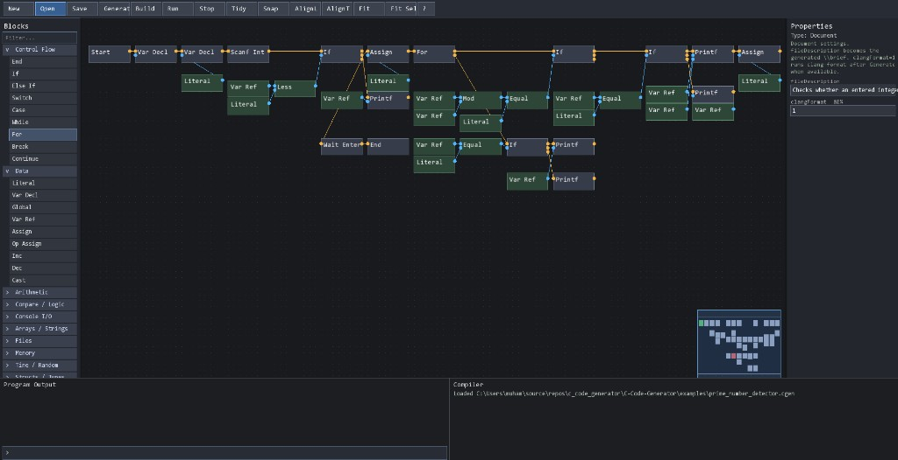
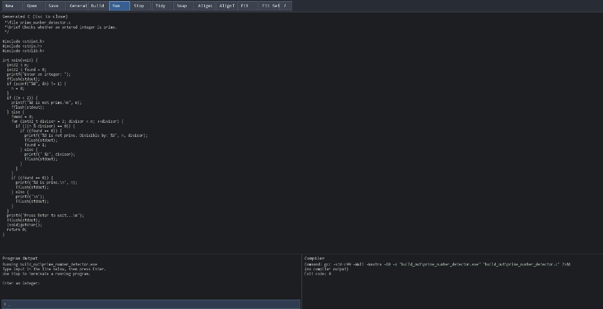

# C Code Generator

**Wire a flowchart. Get real C99.**

A visual block editor that turns graphs into compilable C — then builds and runs them in the same window. Built for teaching, exploration, and anyone who thinks better in diagrams than in blank `.c` files.

<p align="center">
  
</p>

<p align="center"><em>Prime number detector as a flowchart — blocks, wires, properties, minimap.</em></p>

<p align="center">
  
</p>

<p align="center"><em>Generate → Build → Run: C source, gcc log, and live Program Output in one place.</em></p>

---

## Why this exists

Most “visual coding” tools hide the language. This one **exposes C**:

- You place **blocks** (control flow, data, I/O, files, memory, structs, functions, …)
- You connect **amber control** and **blue data** wires
- **Generate C** validates the graph, writes `build_out/<name>.c`, and can run **clang-format**
- **Build** / **Run** use `gcc` and stream stdin/stdout in the bottom panes

Open an example, press Generate, and you can see exactly how the graph maps to C.

---

## Features at a glance

| Area | What you get |
| --- | --- |
| **Editor** | Collapsible block palette, snap/align, tidy layout, minimap, multi-select, undo/redo, copy/paste |
| **Typing** | Named types (`Hero`, `FILE*`, `bool`, …), live green/red wire preview, property dropdowns |
| **Functions** | Typed FunctionDef params, Call arity checks, collapse FunctionDef bodies |
| **Types & memory** | Struct / Enum / Typedef decls, Struct Literal, Address Of, Deref Get/Set, Malloc/Free |
| **Output** | Doxygen `\file` / `\brief`, optional clang-format, in-app source view |
| **CLI** | Headless `--codegen` with optional `--compile` / `--run` |

---

## Quick start (Windows)

```powershell
.\scripts\build.ps1
.\build\c_code_generator.exe
```

Then **Open** → `examples/prime_number_detector.cgen` → **Generate C** → **Build** → **Run**.

Or stay in the terminal:

```powershell
"7" | .\build\c_code_generator.exe --codegen examples\prime_number_detector.cgen --run
```

`--codegen` writes C only. Add `--compile` for gcc, or `--run` to compile and execute.

<details>
<summary><strong>Requirements & other ways to build</strong></summary>

### Requirements

- CMake 3.20+
- A C++17 compiler (Visual Studio 2022/2026, or MinGW g++)
- Network on the **first** configure/build (to download SFML unless already cached)
- `gcc` on `PATH` for in-app **Build** / **Run**
- Optional: `clang-format` on `PATH` when Document `clangFormat=1`

| Dependency | How it is provided |
| --- | --- |
| nlohmann_json | Vendored in `third_party/nlohmann/json.hpp` |
| SFML 3 | Auto-downloaded into `third_party/sfml` by `scripts/build.ps1`, or via CMake FetchContent |

No vcpkg / manual SFML install is required.

### Visual Studio

1. **File → Open → Folder…** and select this repository  
2. Pick **x64-Debug** or **x64-Release**  
3. Build (first configure downloads SFML if needed)

### Manual CMake

```powershell
cmake -S . -B build -G Ninja -DCMAKE_BUILD_TYPE=Release
cmake --build build
```

### Unit tests

```powershell
git submodule update --init --recursive
cmake --build build --target cgen_unit_tests
ctest --test-dir build --output-on-failure
```

Disable tests with `-DCGEN_BUILD_TESTS=OFF` if needed.

</details>

---

## Example projects

### Feature primers

Short graphs that teach one IR feature.

| File | Shows | Expected output |
| --- | --- | --- |
| [`ex_struct_literal.cgen`](examples/ex_struct_literal.cgen) | Struct Literal | `point = (3, 7)` |
| [`ex_multi_arg_call.cgen`](examples/ex_multi_arg_call.cgen) | Multi-arg Call | `add3(10, 20, 12) = 42` |
| [`ex_address_of.cgen`](examples/ex_address_of.cgen) | Address Of + `Hero*` | `hero.hp after bump = 11` |
| [`ex_malloc_free.cgen`](examples/ex_malloc_free.cgen) | Malloc / Free | `pBuf[0] = 42` |

```powershell
.\build\c_code_generator.exe --codegen examples\ex_struct_literal.cgen --run
.\build\c_code_generator.exe --codegen examples\ex_multi_arg_call.cgen --run
.\build\c_code_generator.exe --codegen examples\ex_address_of.cgen --run
.\build\c_code_generator.exe --codegen examples\ex_malloc_free.cgen --run
```

### Larger demos

| Example | Idea |
| --- | --- |
| [`add_two_integers.cgen`](examples/add_two_integers.cgen) | Tiny starter: `a + b` → print |
| [`prime_number_detector.cgen`](examples/prime_number_detector.cgen) | Interactive prime check (screenshots above) |
| [`live_clock.cgen`](examples/live_clock.cgen) | Local time + Sleep loop |
| [`password_generator.cgen`](examples/password_generator.cgen) | Shuffle a typed password policy |
| [`tic_tac_toe.cgen`](examples/tic_tac_toe.cgen) | You vs AI, file history |
| [`dungeon_log.cgen`](examples/dungeon_log.cgen) | Full-featured adventure showcase |

```powershell
# Add two integers
.\build\c_code_generator.exe --codegen examples\add_two_integers.cgen --run

# Prime detector
"8" | .\build\c_code_generator.exe --codegen examples\prime_number_detector.cgen --run

# Live clock (Ctrl+C to stop)
.\build\c_code_generator.exe --codegen examples\live_clock.cgen --run

# Password generator (total, digits, specials, uppers)
"16`n3`n2`n3" | .\build\c_code_generator.exe --codegen examples\password_generator.cgen --run

# Tic Tac Toe / Dungeon Log — interactive in the GUI, or pipe stdin for CLI
.\build\c_code_generator.exe --codegen examples\tic_tac_toe.cgen --run
```

**Dungeon Log** covers nearly every block family (structs, multi-arg Call, Address Of, Malloc/Free, files, time). Snapshot: [`examples/build_out/dungeon_log.c`](examples/build_out/dungeon_log.c).

---

## Using the editor

- **Place** blocks from the left palette (filter by name); connect control and data ports
- Wire preview turns **green/red** for type compatibility
- **Snap** / **AlignL** / **AlignT** / **Tidy** (Ctrl+L); **Fit** / **Fit Sel**; canvas **minimap**
- Property dropdowns for `type`, `op`, `access`, `function`, … — clear selection for Document `fileDescription` / `clangFormat`
- **FunctionDef**: typed params + Param ports; double-click to collapse the body
- **Generate C**: validates (click issues to jump), writes `.c`, optional clang-format, shows source (Esc closes)
- **Build** / **Run** / **Stop**: gcc in Compiler; stdin via the Program Output input line
- **?** / **F1** for in-app help · projects save as `.cgen` (CGEN 1 + JSON)

---

## Project layout

| Path | Role |
| --- | --- |
| `include/`, `src/` | Application code |
| `tests/` | GoogleTest (`cgen_unit_tests`) |
| `examples/` | Sample `.cgen` projects |
| `docs/screenshots/` | README images |
| `scripts/build.ps1` | One-shot fetch + build |
| `third_party/` | Vendored JSON, GoogleTest submodule, local SFML (gitignored after download) |
| `build_out/` | Generated C and executables |

---

## License & status

Releases are tagged as `V_x.y.z.R`. If you use this in a classroom or fork it, a root `LICENSE` file is recommended — open an issue if you’d like one added.
